# 🎓 Campus Food Waste Redistribution Network
## Design Methodology Document

> **Version:** 1.0 | **Date:** February 2026  
> *A technical and architectural overview of the platform design, system components, and data flows.*

---

## Table of Contents

1. [Project Philosophy](#1-project-philosophy)
2. [System Architecture Overview](#2-system-architecture-overview)
3. [Component Design](#3-component-design)
4. [Authentication Flow](#4-authentication-flow)
5. [Core Use Case Flows](#5-core-use-case-flows)
6. [Database Schema Design](#6-database-schema-design)
7. [Real-Time & AI Layer](#7-real-time--ai-layer)
8. [Security Design](#8-security-design)
9. [Gamification Design](#9-gamification-design)
10. [Technology Stack Summary](#10-technology-stack-summary)

---

## 1. Project Philosophy

The design of this system is guided by three core principles:

| Principle | Description |
|---|---|
| **Zero Wastage** | Every piece of surplus food should have a path to a student, not a landfill |
| **Real-Time Transparency** | All stakeholders see live status — no ambiguity about availability |
| **Smart & Scalable** | AI-augmented recommendations and a modular backend that scales to other campuses |

The system follows an **event-driven, role-separated architecture** where each actor (student, donor, admin) interacts with a distinct interface, while the backend serves as the single source of truth.

---

## 2. System Architecture Overview

### 2.1 High-Level Architecture

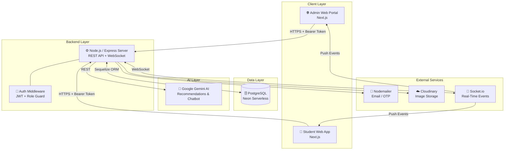

### 2.2 Deployment Topology

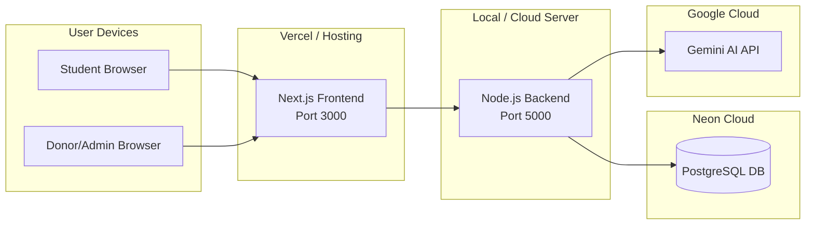

---

## 3. Component Design

### 3.1 Component Responsibility Map

```mermaid
graph TD
    subgraph "Frontend Components"
        P1[ProtectedRoute<br/>Role Guard]
        P2[Donor Dashboard<br/>Post / History / Pickup]
        P3[Student Dashboard<br/>Browse / Reserve / QR]
        P4[Admin Dashboard<br/>Stats / Users / AI Insights]
        P5[Login / Register<br/>OTP Verification]
    end

    subgraph "Backend Routes"
        R1[/auth<br/>Login, Register, OTP, Reset]
        R2[/food<br/>Create, Available, My-Listings]
        R3[/reservation<br/>Create, Pickup Verify]
        R4[/ai<br/>Recommend, Chatbot, Notify]
    end

    subgraph "Middleware"
        M1[authenticate<br/>JWT Verify]
        M2[authorize<br/>Role Check]
    end

    P2 -->|POST /food/create| R2
    P3 -->|GET /food/available| R2
    P3 -->|POST /reservation| R3
    P4 -->|GET stats, users| R1
    P5 -->|POST /auth/login| R1

    R1 --> M1
    R2 --> M1 --> M2
    R3 --> M1 --> M2
    R4 --> M1
```

### 3.2 Frontend Page Structure

```mermaid
graph TD
    ROOT[/ Root]
    ROOT --> LAND[/landing - Landing Page]
    ROOT --> LOGIN[/login - Login]
    ROOT --> REG[/register - Register]
    ROOT --> OTP[/verify-email - OTP Verify]
    ROOT --> FORGOT[/forgot-password]
    ROOT --> DONOR[/donor - Donor Dashboard]
    ROOT --> STUDENT[/student - Student Dashboard]
    ROOT --> ADMIN[/admin - Admin Dashboard]

    DONOR -->|Protected: donor role| D1[Post Food Tab]
    DONOR -->|Protected: donor role| D2[Pickup Verify Tab]
    DONOR -->|Protected: donor role| D3[Donation History Tab]

    STUDENT -->|Protected: student role| S1[Browse Food Tab]
    STUDENT -->|Protected: student role| S2[My Reservations Tab]
    STUDENT -->|Protected: student role| S3[Leaderboard Tab]
```

---

## 4. Authentication Flow

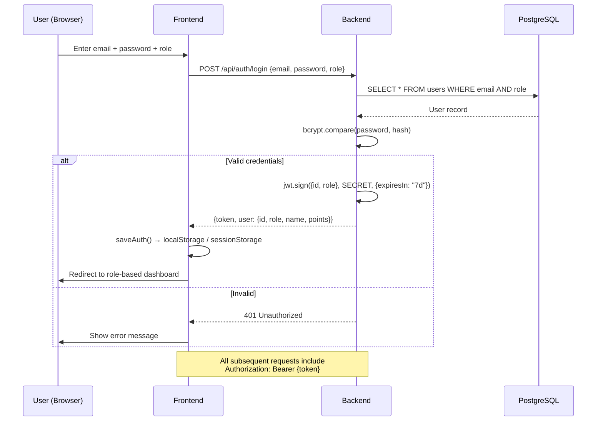

### OTP Registration Flow

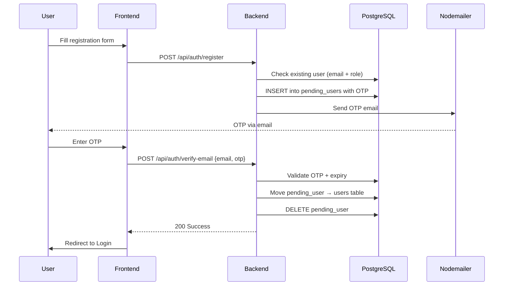

---

## 5. Core Use Case Flows

### 5.1 Donor Posts Food

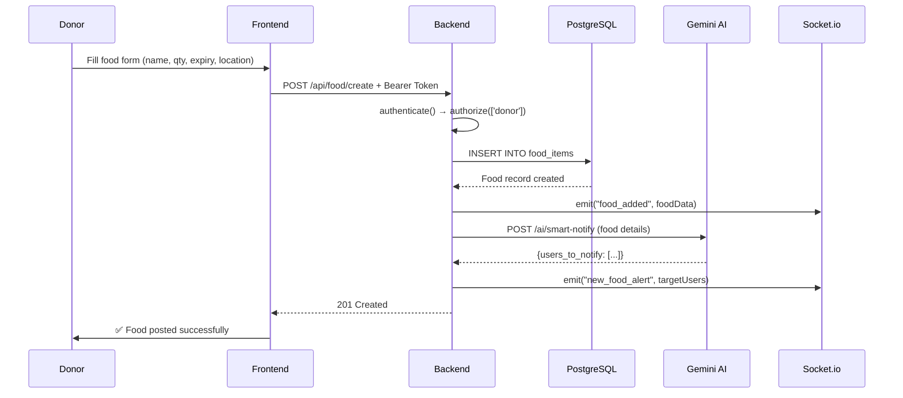

### 5.2 Student Reserves Food

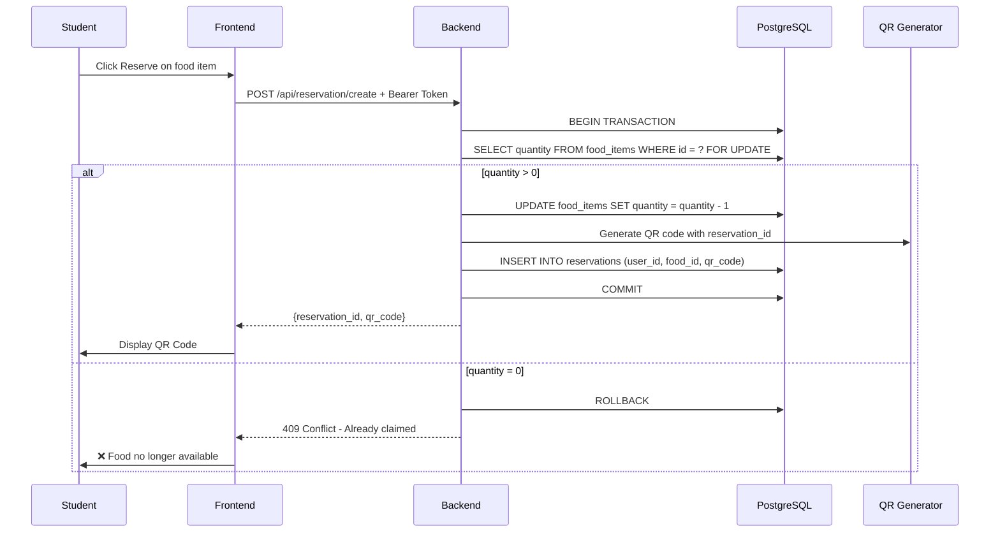

### 5.3 QR Code Pickup Verification

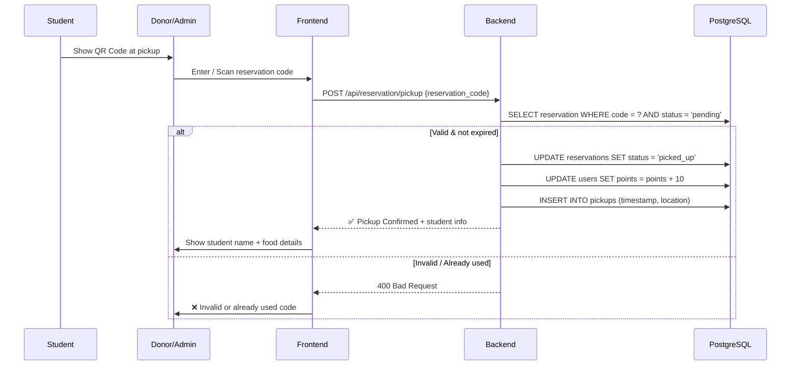

---

## 6. Database Schema Design

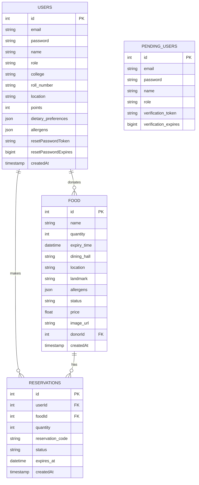

---

## 7. Real-Time & AI Layer

### 7.1 Real-Time Event Architecture (Socket.io)

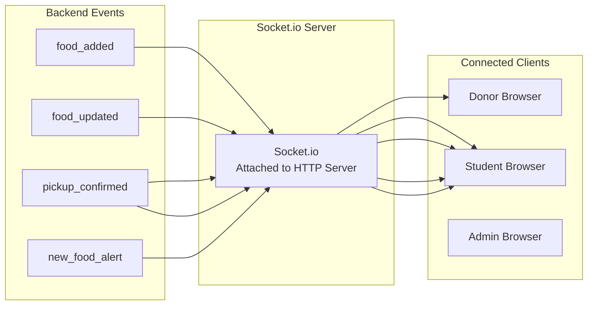

### 7.2 AI Module Interaction Flow

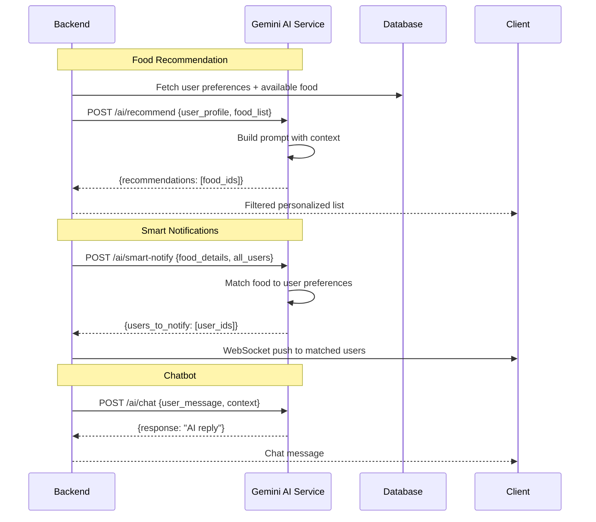

---

## 8. Security Design

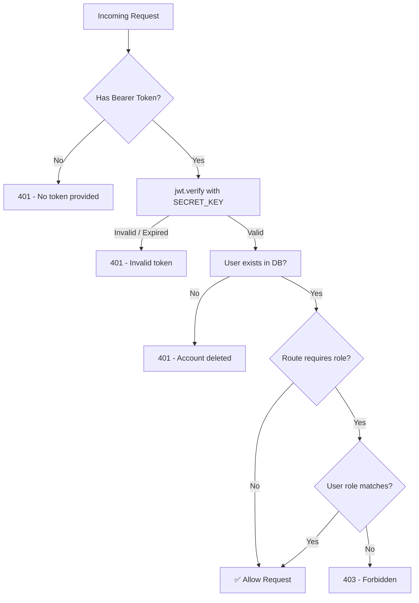

### Security Measures Summary

| Threat | Mitigation |
|---|---|
| Unauthorized access | JWT on every protected route |
| Role escalation | `authorize()` middleware checks role per route |
| Password exposure | `bcrypt` with salt factor 10 |
| SQL Injection | Sequelize ORM with parameterized queries |
| Token theft | Short-lived tokens + server-side user existence check |
| QR misuse | One-time use codes checked server-side with expiry |
| OTP brute force | 10-minute OTP expiry + stored in `pending_users` |

---

## 9. Gamification Design

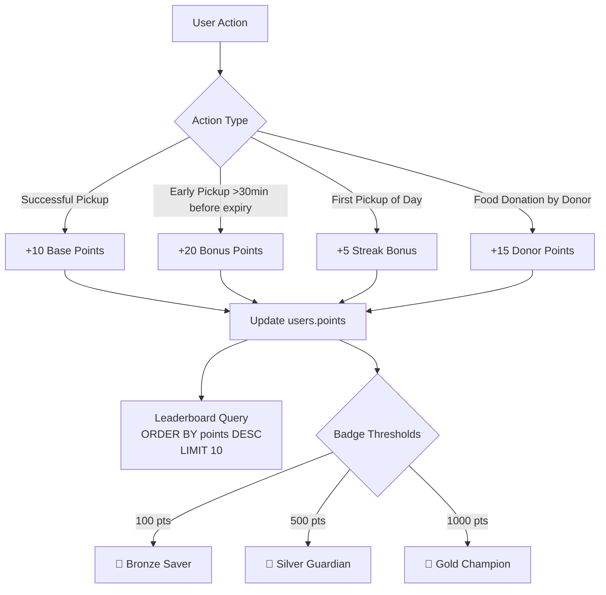

---

## 10. Technology Stack Summary

| Layer | Technology | Purpose |
|---|---|---|
| **Frontend** | Next.js 14 (App Router) | Student & Admin Web UI |
| **Styling** | Tailwind CSS + shadcn/ui | Component design system |
| **State** | React hooks + Context | Local UI state |
| **HTTP Client** | Axios (with interceptors) | API calls with auto-auth |
| **Animation** | Framer Motion | UI transitions |
| **Backend** | Node.js + Express | API server |
| **Real-Time** | Socket.io | Live food updates & notifications |
| **Database** | PostgreSQL (Neon Serverless) | Relational data storage |
| **ORM** | Sequelize | DB abstraction + migrations |
| **Auth** | JWT + bcryptjs | Stateless auth + password hashing |
| **Email** | Nodemailer + Gmail | OTP & notifications |
| **AI** | Google Gemini API | Recommendations, chatbot |
| **Image Storage** | Base64 / Cloudinary | Food images |
| **QR Codes** | `qrcode` npm package | Reservation verification |

---

## Design Methodology: Summary

This system adopts a **Layered, Event-Driven Architecture** with the following methodology decisions:

1. **Separation of Concerns** — Each role (student, donor, admin) has its own isolated frontend page and backend authorization layer
2. **API-First Design** — All interactions go through REST APIs; the frontend is a pure consumer
3. **Real-Time by Default** — WebSocket events supplement REST for immediate UI updates without polling
4. **AI as a Service** — The AI layer is stateless and separate; it only processes and returns data, never accesses the DB directly
5. **Defense in Depth** — Security is applied at the middleware, route, and DB level
6. **Gamification as a Driver** — Points and badges are a first-class design element to sustain engagement
7. **Transaction Safety** — Critical sections (reservations) use DB transactions to prevent race conditions

> *"This platform treats surplus food as a resource, not waste — and the architecture reflects the same philosophy: every component is purposeful, connected, and accountable."*
