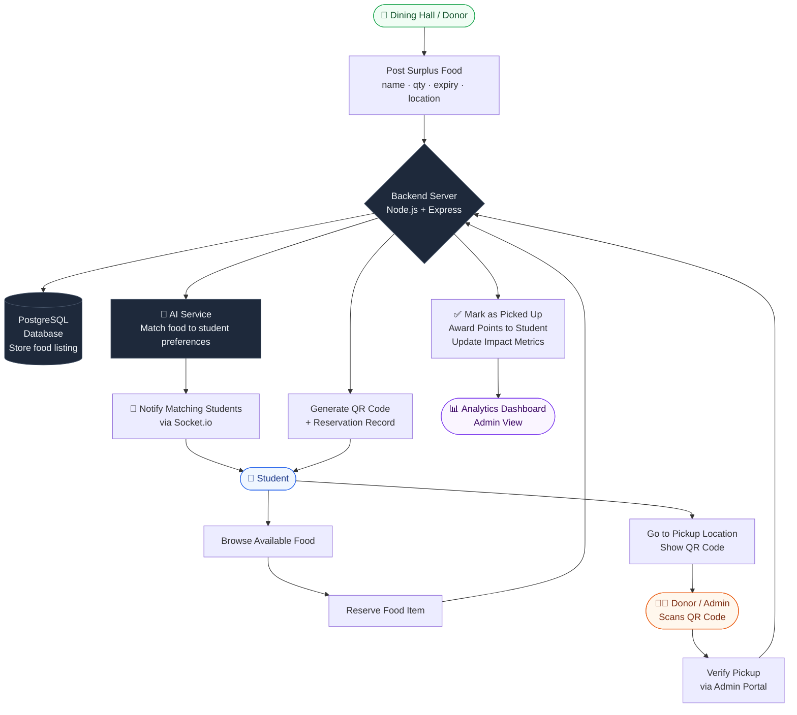

# Campus Food Waste Redistribution Network
## High-Level System Flow Diagram

## Flow Summary

| Step | Actor | Action |
|------|-------|--------|
| 1 | **Donor** | Posts surplus food with details |
| 2 | **Backend** | Saves listing & triggers AI matching |
| 3 | **AI** | Identifies students whose preferences match |
| 4 | **System** | Sends real-time notification to matched students |
| 5 | **Student** | Browses and reserves a food item |
| 6 | **Backend** | Generates a unique QR code for the reservation |
| 7 | **Student** | Arrives at pickup location and shows QR code |
| 8 | **Donor/Admin** | Scans QR to verify and confirm pickup |
| 9 | **System** | Awards points, updates impact metrics |
| 10 | **Admin** | Views analytics on food saved and participation |
