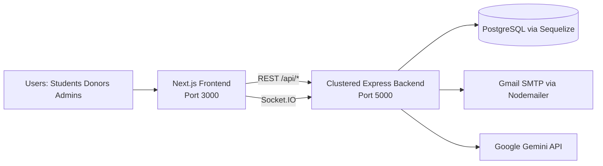
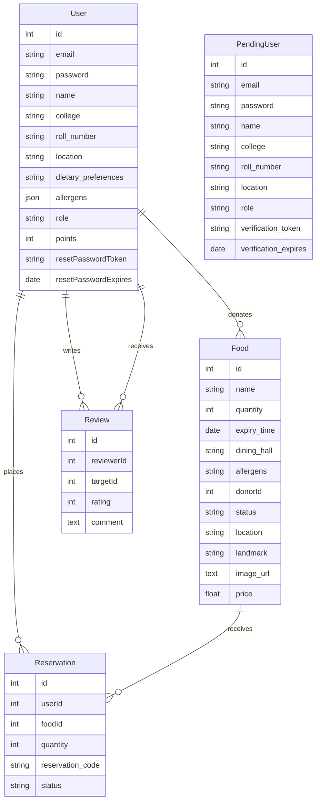
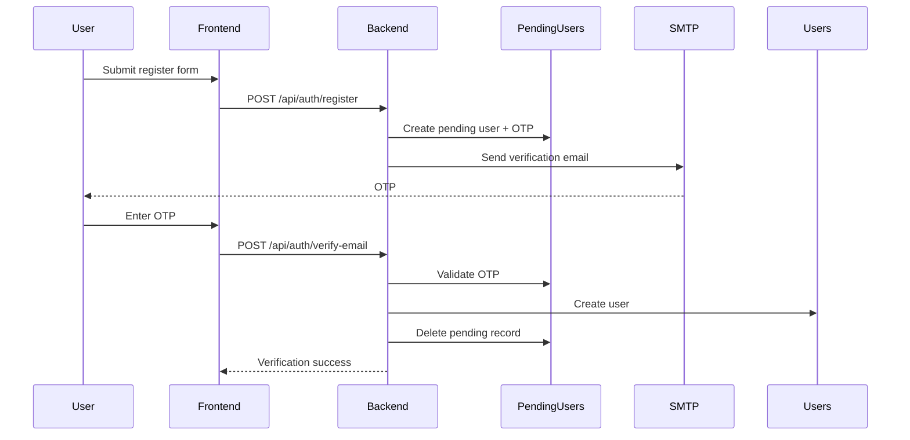
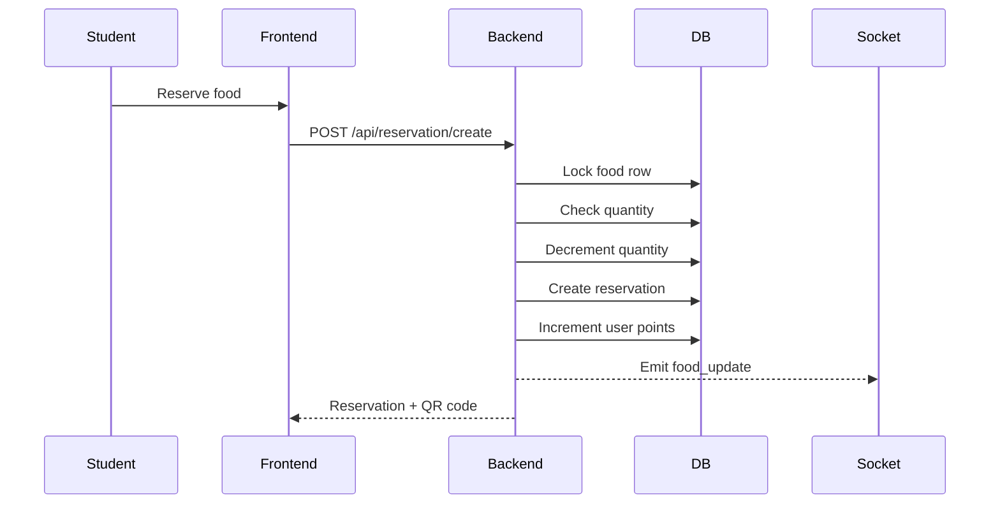

# Campus Food Redistribution

## Current System Architecture Report

**Report Date:** March 28, 2026  
**Scope:** This document describes the **currently implemented architecture** in the repository, not the earlier proposed serverless design.

---

## 1. Executive Summary

The current system is a **local full-stack web application** made of:

- A **Next.js 16 + React 19 frontend** running separately on `localhost:3000`
- A **clustered Express 5 backend** with **Socket.IO** running on `localhost:5000`
- A **PostgreSQL database** accessed through **Sequelize**
- External integrations for **email OTP delivery** through Gmail SMTP and **food recommendation / analytics support** through Google Gemini

The architecture is primarily **modular monolith + separate frontend**:

- The frontend is a standalone web client
- The backend exposes REST APIs and WebSocket events
- The backend owns authentication, authorization, business rules, reservation transactions, QR generation, and analytics logic
- The database stores users, pending registrations, food listings, reservations, and review data

---

## 2. High-Level Architecture

---

## 3. Runtime Topology

### 3.1 Frontend Runtime

- Framework: **Next.js 16.1.6**
- UI runtime: **React 19.2.3**
- Styling: **Tailwind CSS v4**
- Component base: **shadcn/ui + Radix UI**
- Client-side API access: **Axios**
- Client-side realtime: **socket.io-client**

The frontend is a pure client-facing app and talks directly to the backend using:

- `http://localhost:5000/api` for REST APIs
- `http://localhost:5000` for WebSocket connections

### 3.2 Backend Runtime

- Runtime: **Node.js**
- Framework: **Express 5.2.1**
- Realtime layer: **Socket.IO 4.8.3**
- Compression: **compression**
- CORS enabled
- Request body size increased to `50mb` for image/base64 payload support

The backend starts through `backend/cluster.js`, which:

- Detects CPU core count
- Forks one worker per CPU core
- Restarts workers on crash

Each worker loads `backend/server.js`, which:

- Creates the Express app
- Wraps it in an HTTP server
- Attaches Socket.IO
- Registers route modules
- Connects to Sequelize
- Calls `sequelize.sync({ alter: true })` before listening

### 3.3 Database Runtime

- Database dialect: **PostgreSQL**
- ORM: **Sequelize**
- SSL enabled for DB connection
- Small connection pool per worker:
  - `max: 5`
  - `min: 0`
  - `acquire: 30000`
  - `idle: 10000`

This setup is consistent with a Neon/Postgres-style hosted database connection, but the codebase itself only implements the PostgreSQL client layer, not a full serverless DB architecture.

---

## 4. Architectural Style

The implemented system is best described as:

- **Client-server architecture**
- **Separated frontend and backend**
- **Backend modular monolith**
- **Role-based application**
- **Stateful realtime backend**
- **Relational persistence with ORM**

It is **not** currently implemented as:

- Vercel serverless functions
- Cloudflare edge architecture
- Upstash Redis
- QStash queues
- Pusher channels
- Redis-backed distributed cache

---

## 5. Major Components

## 5.1 Frontend Application

The frontend is organized by user-facing surfaces:

- **Public surface**
  - Landing page
  - Login
  - Registration
  - OTP verification
  - Forgot password

- **Student surface**
  - Food dashboard
  - Reservation history
  - Leaderboard
  - Profile and dietary preferences

- **Donor surface**
  - Food posting
  - Camera/image upload
  - Pickup verification
  - Donation history
  - Placeholder analytics

- **Admin surface**
  - System overview
  - User management
  - Food oversight
  - AI waste analytics
  - Pickup verification

### Frontend Responsibilities

- Render all UI flows
- Store auth state in browser storage
- Attach JWT automatically to REST requests
- Gate pages by role using a protected route wrapper
- Consume realtime food updates over Socket.IO
- Open external Google Maps search for pickup location
- Capture donor images via camera or file upload

## 5.2 Backend Application

The backend is split into route modules:

- `auth`
- `food`
- `reservation`
- `ai`

### Backend Responsibilities

- Issue and validate JWTs
- Enforce role-based authorization
- Manage email OTP registration
- Manage password reset OTP flow
- Create and fetch food listings
- Create reservations transactionally
- Generate QR codes for reservations
- Verify pickup actions
- Broadcast realtime food events
- Compute admin analytics
- Call Gemini for personalized food recommendation

## 5.3 Database Layer

The database is the system of record for:

- users
- pending users awaiting verification
- food listings
- reservations
- review entities

## 5.4 External Services

### Gmail SMTP

Used through Nodemailer for:

- registration OTP emails
- forgot-password OTP emails

### Google Gemini

Used in `/api/ai/recommend` to rank candidate food items against user preferences when dietary preference is set.

---

## 6. Frontend Architecture Details

## 6.1 Routing Structure

The frontend uses the Next.js App Router and route groups/layouts:

- `src/app/(public)`
- `src/app/dashboard`
- `src/app/donor`
- `src/app/admin`

Each protected area has its own layout and theme provider.

## 6.2 Authentication Model

Auth state is stored in browser storage under a single key:

- `sessionStorage` when "remember me" is not selected
- `localStorage` when "remember me" is selected

Stored auth payload includes:

- user id
- role
- token
- optional display info

Every Axios request adds:

- `Authorization: Bearer <token>`

Page access is guarded in the frontend by `ProtectedRoute`, which:

- checks local auth state
- compares role to the page's allowed role
- validates the session against `/api/auth/user/me`
- redirects to the correct role dashboard if mismatched

## 6.3 Realtime Model

The student dashboard opens a Socket.IO connection to the backend and listens for:

- `food_added`
- `food_update`

The dashboard updates local food state immediately when those events arrive.

## 6.4 Image Handling

The donor UI supports:

- device camera capture
- local image upload

Images are converted to **base64/data URLs in the browser** and sent directly in the `image_url` field of the create-food request. There is no separate media service or file storage bucket.

---

## 7. Backend Architecture Details

## 7.1 Bootstrap Sequence

1. `backend/cluster.js` starts
2. Primary process forks one worker per CPU core
3. Each worker loads `backend/server.js`
4. Express middleware is configured
5. Socket.IO is attached to the HTTP server
6. Route modules are registered
7. Sequelize connects and syncs schema with `alter: true`
8. Worker begins listening on port `5000`

## 7.2 Middleware and Cross-Cutting Concerns

### CORS

- Currently configured broadly with wildcard origin
- Allows `GET`, `POST`, `PUT`, `DELETE`

### Compression

- All responses are compressed using `compression()`

### JSON Parsing

- JSON and URL-encoded bodies are accepted up to `50mb`

### Shared Socket Access

- `req.io` is injected into requests so route handlers can emit WebSocket events

### Error Handling

- A global error handler catches malformed JSON and internal errors

## 7.3 Cache Layer

The `food` route module uses **node-cache** with:

- `stdTTL: 5`
- `checkperiod: 2`

Cache is applied to:

- `/api/food/stats`
- `/api/food/available`

### Important Architectural Constraint

Because the backend is clustered:

- each worker has its **own private in-memory cache**
- cache entries are **not shared across workers**
- `flushAll()` only clears the cache inside the current worker process

This means the cache is an **in-process optimization**, not a distributed cache.

## 7.4 Realtime Event Emission

The backend emits:

- `food_added` after a donor posts food
- `food_update` after a reservation reduces food quantity

### Important Architectural Constraint

Socket.IO is attached independently inside each worker. Without a shared adapter:

- broadcasts are local to the worker handling the request
- clients connected to other workers may not receive the event

---

## 8. Service Modules

## 8.1 Authentication Service

Implemented in `backend/routes/auth.js`.

### Capabilities

- login
- student/donor registration
- email verification via OTP
- user profile fetch
- dietary/allergen profile update
- leaderboard fetch
- admin user listing
- admin user deletion
- forgot-password OTP
- OTP verification
- password reset

### Auth Characteristics

- JWT-based authentication
- roles embedded in JWT
- request-time user existence check
- role-based authorization middleware

### Registration Design

Public registration creates a row in `PendingUsers`.

After OTP verification:

- a real `User` record is created
- the pending record is deleted

### Multi-Role Identity Design

The system allows the same email to exist under different roles through a composite unique index on:

- `(email, role)`

This is why login sends both:

- `email`
- `role`

## 8.2 Food Service

Implemented in `backend/routes/food.js`.

### Capabilities

- admin stats
- donor food creation
- student/admin available food listing
- admin full food listing
- donor listing history
- admin delete food item

### Business Logic

- food must have name, quantity, expiry, and location/dining hall
- donor ID is attached from the JWT
- allergens are stored as serialized JSON strings
- `location` defaults to `dining_hall` if absent
- newly created food defaults to `status: available`

## 8.3 Reservation Service

Implemented in `backend/routes/reservation.js`.

### Capabilities

- create reservation
- fetch student's reservations
- verify pickup

### Reservation Transaction Flow

Reservation creation uses a Sequelize transaction:

1. lock food row
2. validate quantity
3. decrement food quantity
4. create reservation record
5. add points to student
6. commit transaction
7. emit realtime update
8. generate QR code

This is the main concurrency-safe flow in the backend.

### QR Handling

QR codes are generated on demand using the reservation code and returned as data URLs.

## 8.4 AI and Analytics Service

Implemented in `backend/routes/ai.js`.

### Student Recommendation

`/api/ai/recommend`:

- loads the latest user profile
- fetches all currently available food
- removes food containing blocked allergens
- if diet is unspecified or "Any", falls back to expiry-based ranking
- otherwise calls Gemini to choose the best matching food IDs
- falls back again if AI parsing or generation fails

### Admin Waste Prediction

`/api/ai/waste-prediction` calculates:

- items at risk in the next 7 days
- urgent items expiring in 24 hours
- recommendation type such as discount or donate
- estimated CO2 savings
- tree-equivalent impact
- food lifecycle statistics

### Automated Suggestion Application

`/api/ai/apply-suggestion`:

- discounts urgent items
- or marks surplus items for priority donation

This is implemented as synchronous DB updates, not as background jobs.

---

## 9. Data Model

### Current Data Notes

- `User.allergens` is modeled as JSON
- `Food.allergens` is modeled as stringified JSON text
- `Food.image_url` holds inline image data or external URL text
- `Review` exists in the model layer but is not currently exposed through API routes/UI

---

## 10. Core End-to-End Flows

## 10.1 Registration and Verification Flow

## 10.2 Login Flow

1. User selects a role-specific portal
2. Frontend sends `email + password + role`
3. Backend looks up `User` by email and role
4. Password is checked with bcrypt
5. JWT is returned
6. Frontend stores auth in browser storage
7. Protected pages validate the session through `/api/auth/user/me`

## 10.3 Donor Posting Flow

1. Donor creates a listing in the donor dashboard
2. Optional image is captured/uploaded and converted to a data URL
3. Frontend sends payload to `/api/food/create`
4. Backend stores the food record
5. Backend emits `food_added`
6. Backend flushes in-memory food cache
7. Student dashboard can show the new item

## 10.4 Student Reservation Flow

## 10.5 Pickup Verification Flow

1. Student receives QR code and reservation code
2. Donor or admin opens pickup verification screen
3. Code is scanned or typed manually
4. Frontend calls `/api/reservation/pickup`
5. Backend validates reservation state
6. Reservation status is updated to `picked_up`
7. Reservation and user details are returned

## 10.6 Admin Monitoring Flow

The admin dashboard polls every 30 seconds and loads:

- all users
- all food
- food stats
- waste prediction analytics

Admin actions currently include:

- delete user
- delete food listing
- apply AI suggestion

---

## 11. API Surface Summary

### Authentication APIs

- `GET /api/auth/user/me`
- `PUT /api/auth/profile`
- `POST /api/auth/login`
- `POST /api/auth/register`
- `POST /api/auth/verify-email`
- `GET /api/auth/leaderboard`
- `GET /api/auth/users`
- `DELETE /api/auth/users/:id`
- `POST /api/auth/forgot-password`
- `POST /api/auth/verify-otp`
- `POST /api/auth/reset-password`

### Food APIs

- `GET /api/food/stats`
- `POST /api/food/create`
- `GET /api/food/available`
- `GET /api/food/all`
- `GET /api/food/my-listings`
- `DELETE /api/food/:id`

### Reservation APIs

- `POST /api/reservation/create`
- `GET /api/reservation/my`
- `POST /api/reservation/pickup`

### AI APIs

- `GET /api/ai/recommend`
- `GET /api/ai/waste-prediction`
- `POST /api/ai/apply-suggestion`

---

## 12. Security and Access Control

### Authentication

- JWT bearer authentication
- Token is required for all protected routes

### Authorization

Roles supported:

- `student`
- `donor`
- `admin`

Role checks are performed in backend middleware and mirrored in frontend route guards.

### Current Security Constraints

- JWT secret is hardcoded as `"SECRET_KEY"`
- CORS is currently configured with wildcard origin
- images are accepted inline through large request bodies
- admin creation is not part of the public registration flow

---

## 13. Configuration and Environment Dependencies

The current system expects environment variables for:

### Database

- `DB_USERNAME`
- `DB_PASSWORD`
- `DB_NAME`
- `DB_HOST`
- `DB_PORT`
- `DB_HOSTNAME` (optional, for SNI/servername)

### Email

- `EMAIL_USER`
- `EMAIL_PASS`

### AI

- `GEMINI_API_KEY`

### Seed / Admin

- `ADMIN_EMAIL`
- `ADMIN_PASSWORD`

---

## 14. Known Architectural Limitations

The current implementation works, but these are important architectural constraints:

### 14.1 Local, Hardcoded Service Endpoints

- frontend REST base URL is hardcoded to `http://localhost:5000/api`
- frontend Socket.IO URL is hardcoded to `http://localhost:5000`

### 14.2 Per-Worker Cache

- cache is not shared across cluster workers
- invalidation is local to the worker that handled the write

### 14.3 Per-Worker WebSocket Broadcasting

- without a shared Socket.IO adapter, broadcasts are not guaranteed to reach clients connected through other workers

### 14.4 Runtime Schema Mutation

- `sequelize.sync({ alter: true })` changes schema during startup
- this is convenient for development but risky for controlled production deployments

### 14.5 Mixed Allergen Storage Types

- `User.allergens` is JSON
- `Food.allergens` is stringified JSON

### 14.6 Inline Image Storage

- large images are stored inline as text
- this can increase payload size, DB size, and response size

### 14.7 Hardcoded JWT Secret

- current secret handling should be moved to environment configuration

### 14.8 No Queue / Background Worker Layer

- OTP sending
- AI calls
- analytics updates
- suggestion application

all run in the request-response path.

---

## 15. Current Architecture vs Earlier Proposal

The repository also contains earlier architecture documents describing a much more distributed design using:

- Cloudflare
- Vercel serverless
- Upstash Redis
- Upstash QStash
- Pusher

That design is **not the current implementation**.

The **current implemented architecture** is:

- clustered Node/Express backend
- direct Next.js frontend to backend calls
- PostgreSQL via Sequelize
- in-memory worker-local cache
- Socket.IO for realtime

---

## 16. Conclusion

The current Campus Food Redistribution system is a **role-based, full-stack web platform** built around a **Next.js frontend**, a **clustered Express backend**, and a **PostgreSQL relational data store**.

Its strongest implemented architectural characteristics are:

- clear role separation for students, donors, and admins
- transactional reservation handling
- OTP-based registration and password reset flows
- live food updates via WebSockets
- integrated recommendation and waste-analytics features

Its main architectural risks are:

- worker-local cache and Socket.IO state
- hardcoded local URLs and JWT secret
- runtime schema alteration
- inline image storage

This report reflects the **actual current system architecture in code** as of March 28, 2026.
